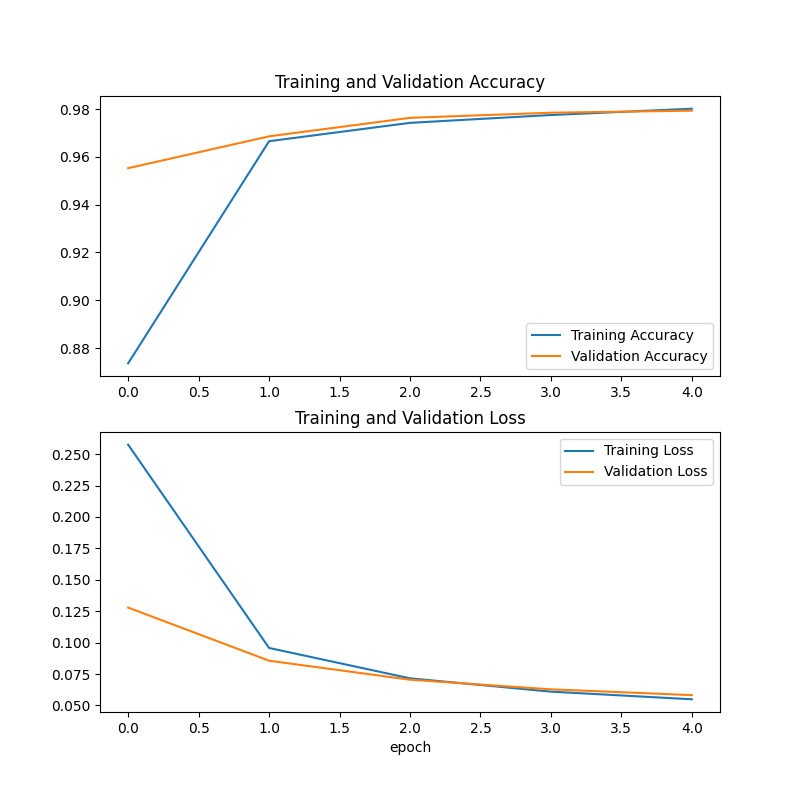
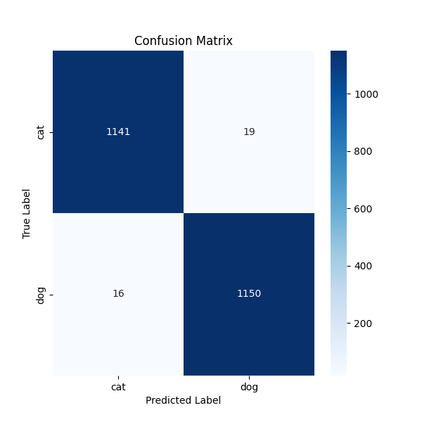

# Project: Cat & Dog Image Classifier

### By: Naraein Gowtham G A

### Project Goal
For this recruitment task, I built an image classifier to tell the difference between pictures of cats and dogs. I was interested in how AI works, and this seemed like a great way to learn the basics.

---

### Tools I Used
I built this in a Google Colab notebook using Python. The main libraries I used were:
- **TensorFlow & Keras:** To build and train the model.
- **Matplotlib & Seaborn:** To create the graphs to visualize the results.
- **Transfer Learning:** I used the pre-trained MobileNetV2 model as a base to speed up the learning process.

---

### How to Run It
The entire project is in the `Image_Classifier.ipynb` file.
1. Open it in Google Colab.
2. Set the runtime to GPU (`Runtime` > `Change runtime type` > `GPU`).
3. Run all the cells (`Runtime` > `Run all`).

---

### My Results
The training went really well. The accuracy went up and the error rate (loss) went down, which is what I wanted to see.

I also created a confusion matrix to check the final performance on test images it had never seen before. The model was very accurate!

